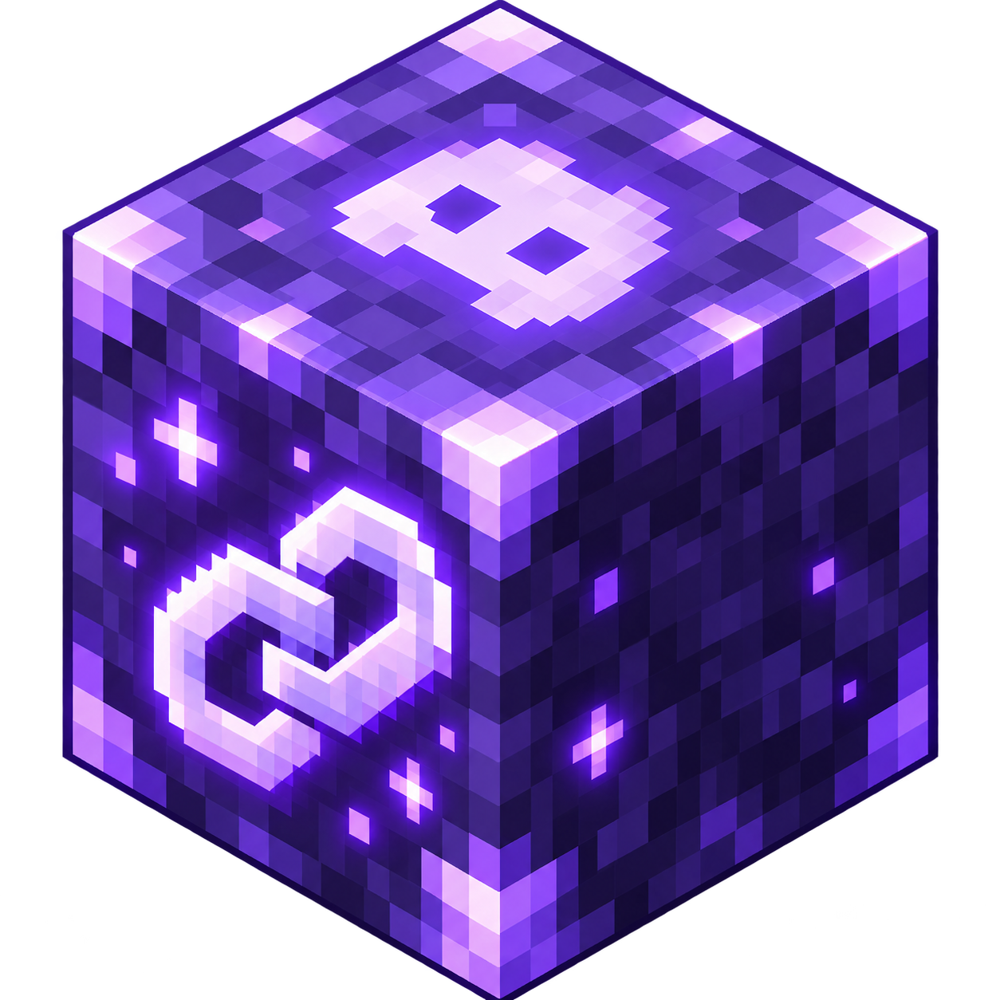

<div align="center">

  
  <h1>DiscordLink</h1>

  <p>
    A modern Minecraft Bedrock ↔ Discord account linking and automatic role synchronization plugin for Endstone.
  </p>

  <p>
    
    
    
    
  </p>

  <p>
    <a href="https://github.com/GravityGDev/Endstone-DiscordLink/graphs/contributors">
      
    </a>
    <a href="https://github.com/GravityGDev/Endstone-DiscordLink/commits/main">
      
    </a>
    <a href="https://github.com/GravityGDev/Endstone-DiscordLink/network/members">
      
    </a>
    <a href="https://github.com/GravityGDev/Endstone-DiscordLink/stargazers">
      
    </a>
    <a href="https://github.com/GravityGDev/Endstone-DiscordLink/issues">
      
    </a>
    <a href="https://github.com/GravityGDev/Endstone-DiscordLink/blob/main/LICENSE">
      
    </a>
  </p>

  <h4>
    <a href="https://github.com/GravityGDev/Endstone-DiscordLink/releases">Releases</a>
    <span> · </span>
    <a href="https://github.com/GravityGDev/Endstone-DiscordLink/issues">Report Bug</a>
    <span> · </span>
    <a href="https://github.com/GravityGDev/Endstone-DiscordLink/issues">Request Feature</a>
  </h4>
</div>

<br />

# :notebook_with_decorative_cover: Table of Contents

- [About the Project](#star2-about-the-project)
  - [Tech Stack](#space_invader-tech-stack)
  - [Features](#dart-features)
  - [Commands](#computer-commands)
  - [Permissions](#closed_lock_with_key-permissions)
  - [Supported Plugins](#electric_plug-supported-plugins)
  - [Role Sync](#arrows_counterclockwise-role-sync)
- [Getting Started](#toolbox-getting-started)
  - [Prerequisites](#bangbang-prerequisites)
  - [Installation](#gear-installation)
  - [Discord Setup](#speech_balloon-discord-setup)
- [Usage](#eyes-usage)
- [Configuration](#wrench-configuration)
- [Contributing](#wave-contributing)
- [License](#warning-license)
- [Acknowledgements](#gem-acknowledgements)

## :star2: About the Project

**DiscordLink** connects Minecraft Bedrock players on an Endstone server to their Discord accounts through a secure six-digit verification flow.

Players start with `/link` in Minecraft, enter their Discord user ID, receive a temporary code, then verify that code from Discord using a slash command or Components V2 button/modal. Once linked, DiscordLink can immediately synchronize configured Discord roles from permission groups, factions and economy data.

The plugin is designed to work **standalone** for account linking while automatically enabling supported integrations when they are installed.

### :space_invader: Tech Stack

<details>
  <summary>Server</summary>
  <ul>
    <li>Endstone API 0.11</li>
    <li>Python 3.11+</li>
    <li>SQLite persistent storage</li>
  </ul>
</details>

<details>
  <summary>Discord</summary>
  <ul>
    <li>Discord Gateway</li>
    <li>Discord REST API</li>
    <li>Components V2</li>
    <li>Slash commands, buttons and modals</li>
  </ul>
</details>

### :dart: Features

| Feature | Description |
| --- | --- |
| 🔗 Account Linking | Links a Minecraft Bedrock account to a Discord account with a six-digit code. |
| 🛡️ Account-Bound Verification | Verification codes only work for the Discord ID entered by the Minecraft player. |
| ⏱️ Temporary Codes | Configurable expiry, retry limits and request cooldowns. |
| 🎛️ Components V2 | Modern Discord verification panel, buttons, modals and private account cards. |
| 🔄 Automatic Role Sync | Syncs roles immediately after a successful link, on join and periodically while players are online. |
| 🧩 Optional Integrations | Supports permissions, factions and economy providers without making them hard dependencies. |
| 🗃️ Persistent Storage | Stores links, pending verification and managed-role state in SQLite. |
| 🧹 Managed Role Cleanup | Removes only roles controlled by DiscordLink and leaves unrelated Discord roles untouched. |
| 🎨 Custom UI | Configurable panel colors, text, buttons, success fields and Minecraft character thumbnail visibility. |
| 👤 Player Character | Optional Minecraft head thumbnail on the private linked-account card. |
| 🛠️ Admin Tools | In-game admin menu and commands for status, panels, syncing, unlinking and config reloads. |
| 🧍 Standalone Mode | Core account linking works even when no supported permission, faction or economy plugin is installed. |

### :computer: Commands

| Platform | Command | Description |
| --- | --- | --- |
| Minecraft | `/link` | Open the Discord linking menu. |
| Minecraft | `/link status` | Show the current account-link status. |
| Minecraft | `/link unlink` | Unlink the current Discord account. |
| Minecraft | `/link sync` | Manually refresh managed Discord roles if needed. |
| Minecraft | `/discord` | Alias of `/link`. |
| Minecraft | `/discordlinkadmin` | Open the DiscordLink admin menu. |
| Minecraft | `/discordlinkadmin panel [channel_id]` | Send the Components V2 verification panel to Discord. |
| Minecraft | `/discordlinkadmin status` | Show DiscordLink status and detected integrations. |
| Minecraft | `/discordlinkadmin reload` | Reload `config.toml`. |
| Minecraft | `/discordlinkadmin sync <player>` | Force a role sync for a linked player. |
| Minecraft | `/discordlinkadmin unlink <player>` | Force-unlink a player's Discord account. |
| Discord | `/verify` | Open the verification-code modal. |
| Discord | `/unlink` | Unlink the Discord account from Minecraft. |
| Discord | `/linkpanel` | Post the verification panel. Intended for administrators. |

Admin command aliases: `/dlinkadmin`, `/discordadmin`, `/dauth`.

### :closed_lock_with_key: Permissions

| Permission | Default | Description |
| --- | --- | --- |
| `discordlink.command.link` | Everyone | Allows `/link`, `/discord`, status, unlink and manual sync. |
| `discordlink.command.admin` | Operator | Allows DiscordLink administration commands and menus. |

### :electric_plug: Supported Plugins

| Plugin / Provider | Support | DiscordLink Usage |
| --- | :---: | --- |
| **StonePerms** | ✅ | Primary group and additional groups → Discord roles. |
| **PurePerms** | ✅ | Primary group and groups → Discord roles. |
| **Factions / zFactions** | ✅ | Faction name and faction rank → Discord roles. |
| **BedrockEconomy** | ✅ | Balance tiers → Discord roles. |
| **KyroMC provider services** | ✅ | Permission, faction and economy provider compatibility. |
| **No integration plugins** | ✅ | Account linking and verified-role assignment still work standalone. |

All integrations are optional and can be individually enabled or disabled in `config.toml`.

### :arrows_counterclockwise: Role Sync

Group role mappings are shared across supported permission plugins, keeping configuration simple:

```toml
[role_sync]
verified_role_id = "123456789012345678"
remove_managed_roles = true
sync_interval_seconds = 60

[role_sync.groups]
default = "123456789012345679"
vip = "123456789012345680"
mvp = "123456789012345681"
moderator = "123456789012345682"
admin = "123456789012345683"

[role_sync.faction_ranks]
leader = "123456789012345684"
officer = "123456789012345685"
member = "123456789012345686"

[role_sync.factions]
Kyro = "123456789012345687"

[[role_sync.economy_tiers]]
min_balance = 10000
max_balance = 99999
role_id = "123456789012345688"

[[role_sync.economy_tiers]]
min_balance = 100000
role_id = "123456789012345689"
```

## :toolbox: Getting Started

### :bangbang: Prerequisites

Before installing DiscordLink you need:

- A Minecraft Bedrock Dedicated Server running **Endstone API 0.11**.
- A Discord application/bot added to your Discord server.
- The bot permission to **Manage Roles**.
- The bot's highest Discord role positioned above every role DiscordLink should manage.

Supported integration plugins are optional.

### :gear: Installation

1. Download the latest `endstone_discordlink-*.whl` from [Releases](https://github.com/GravityGDev/Endstone-DiscordLink/releases).
2. Place the wheel in your Endstone `plugins` directory.
3. Start the server once to generate `plugins/discordlink/config.toml`.
4. Stop the server and configure your Discord bot, guild, verification channel and role mappings.
5. Start the server again.

DiscordLink stores account data in:

```text
plugins/discordlink/discordlink.db
```

### :speech_balloon: Discord Setup

Configure the bot section in `plugins/discordlink/config.toml`:

```toml
[discord]
bot_token = "YOUR_BOT_TOKEN"
guild_id = "YOUR_GUILD_ID"
verification_channel_id = "YOUR_VERIFY_CHANNEL_ID"
require_guild_membership = true
restrict_to_verification_channel = true
gateway_enabled = true
register_commands = true
```

Then post the verification panel with either:

```text
/discordlinkadmin panel
```

or the Discord administrator slash command:

```text
/linkpanel
```

## :eyes: Usage

The default verification flow is intentionally simple:

1. Player runs `/link` in Minecraft.
2. Player taps **Link Discord** and enters their Discord user ID.
3. Minecraft displays a temporary six-digit code.
4. Player opens the Discord verification channel.
5. Player taps **Verify** or runs `/verify` and enters the code.
6. DiscordLink securely links the accounts.
7. Configured Discord roles are synchronized automatically.
8. The player receives a private success card containing the configured account placeholders.

Manual `/link sync` is only intended as a recovery option if something looks out of date.

## :wrench: Configuration

DiscordLink is designed to be heavily customizable from `config.toml` without editing the plugin source.

Available configuration includes:

- Server name and Discord invite.
- Verification channel restrictions.
- Verification code length, expiry, retries and cooldown.
- Guild membership requirement.
- Automatic role-sync interval.
- Verified role.
- Group → role mappings.
- Faction rank → role mappings.
- Faction → role mappings.
- Economy balance tiers.
- Components V2 panel title, description, instructions and button text.
- Panel and success-card colors.
- Private success-card fields and placeholder order.
- Show/hide Minecraft player character thumbnail.
- Minecraft menu titles, messages and buttons.

Example appearance options:

```toml
[ui.panel]
embed_color = "#5865F2"

[ui.success]
embed_color = "#57F287"
show_player_character = true
hide_empty_fields = true
```

## :wave: Contributing

Contributions are welcome. If you find a bug or have an improvement, open an issue or pull request.

<a href="https://github.com/GravityGDev/Endstone-DiscordLink/graphs/contributors">
  
</a>

## :warning: License

Distributed under the **MIT License**. See [`LICENSE`](LICENSE) for details.

## :gem: Acknowledgements

- [Endstone](https://github.com/EndstoneMC/endstone) — Bedrock Dedicated Server plugin framework.
- [Discord Developer Platform](https://discord.com/developers/docs/intro) — interactions, Gateway and Components V2 APIs.
- [Shields.io](https://shields.io/) — README badge chips.
- [Awesome README Template](https://github.com/Louis3797/awesome-readme-template) — README layout foundation.

<div align="center">
  <sub>Built for Minecraft Bedrock servers running Endstone.</sub>
</div>
